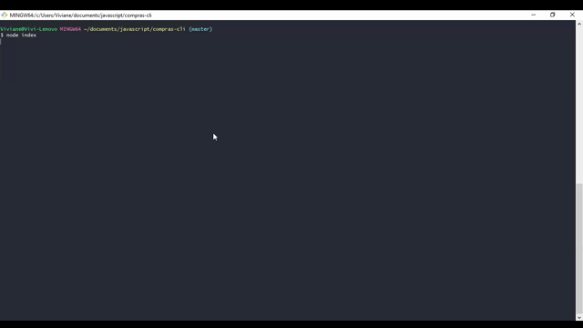

# ShopTech CLI

Command Line Interface que simula um sistema de compras básico de produtos Tech. Feito em NodeJs :heart:.

  
## Tecnologias utilizadas

* [CommanderJs](https://github.com/tj/commander.js/) - Facilita a criação de comandos e manipulação de flags e options

* [InquirerJs](https://github.com/SBoudrias/Inquirer.js) - um agrupador de inputs no CLI (para inputar dados, checkboxes, etc)

* [Chalk](https://github.com/chalk/chalk) - para facilitar o log de informações coloridas

* [FigletJs](https://github.com/patorjk/figlet.js) - para logar textos em letras garrafais — e pode ser utilizado em conjunto com o chalk!

* [CLITable](https://github.com/Automattic/cli-table) - para exibir tabelas no terminal
* [FS](https://nodejs.org/api/fs.html#fs_file_system) - para manipular arquivos do file system

  

## Instalando e executando

Faça o clone do repósitorio:

    git clone https://github.com/Vivi3008/ShopTech-CLI.git

Instale as dependencias:

    yarn

  ou

    npm install

Rode o projeto via terminal.  Dependendo do terminal a tabela de produtos pode aparecer vazia entao use o primeiro comando para rodar. 

    node index
ou

    npm run shoptech

>Prévia

### Author

Made with :heart: by :woman_technologist: [**ViviRamos**](https://linkedin.com/in/viviane-ramos-luz-346169187)

  